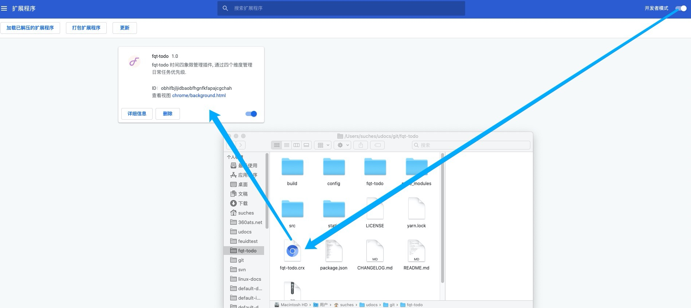
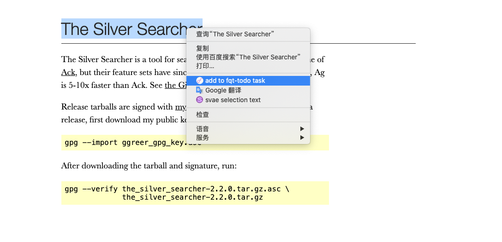
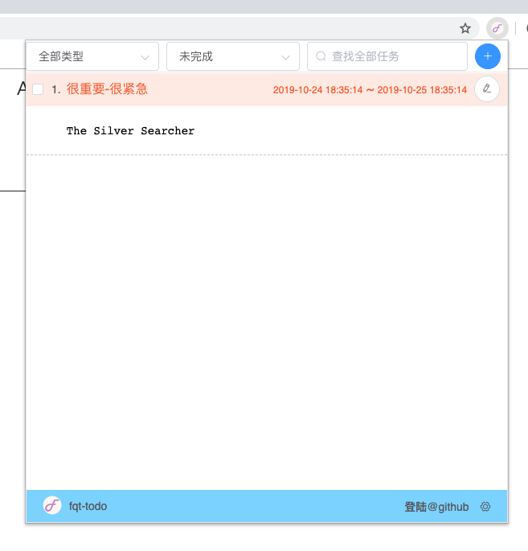
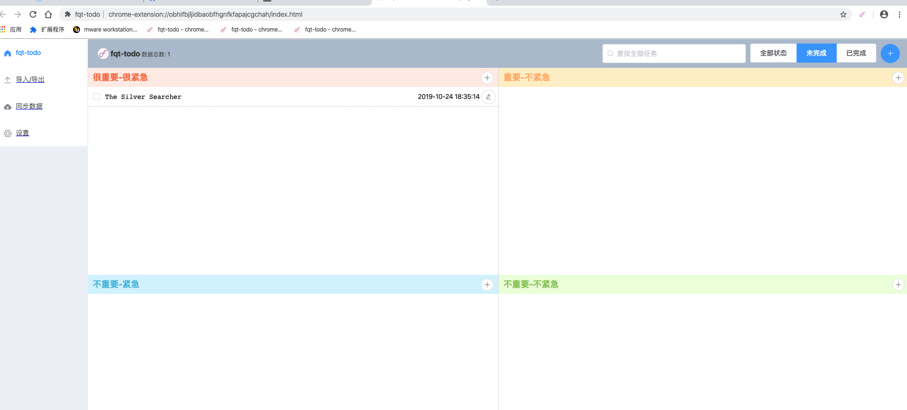

# fqt-todo

four quadrant of time management todolist

时间四象限 todolist

## chrome 浏览器插件 fqt-todo

fqt-todo 可以添加 todo 任务或者右键选择文本保存为任务，把数据存储在本地的 indexedDb

如果需要同步不同机器保存的内容，需要使用 github oauth 登陆授权，然后使用同步功能即可同步不同机器保存的内容 

# 如何使用

## step 1 - 下载插件 

### 从 github 下载 fqt-todo 浏览器插件 离线安装包

[fqt-todo.crx](https://raw.githubusercontent.com/hnjd-fe/fqt-todo/master/dist/fqt-todo-latest.crx)

### 从 chrome 应用商店下载 save-where 浏览器插件

[fqt-todo](https://chrome.google.com/webstore/detail/fqt-todo/obhifbjljidbaobfhgnfkfapajcgchah?hl=zh-CN)

## step 2 - 安装 fqt-todo 浏览器插件

## step 3 - 保存选中的文本（右键选择需要保存的文本，然后在弹出的菜单里点击 "add to fqt-todo task"）

## step 4 - 从插件弹框里获取最新保存的内容（插件弹框默认显示最近保存的50条数据）

## step 5 - 从插件主界面获取最新保存的内容（插件弹框默认显示最近保存的50条数据）

# 开发插件 

## 初始化（进入到插件代码根目录，使用 yarn 初始化开发依赖）
  yarn
  
## 运行本地开发环境
  yarn serve 
  
  http://localhost:8080/index.html
  
  http://localhost:8080/popup.html
  
## 发布代码
  yarn build 
  
  //output dir: ./fqt-todo/
